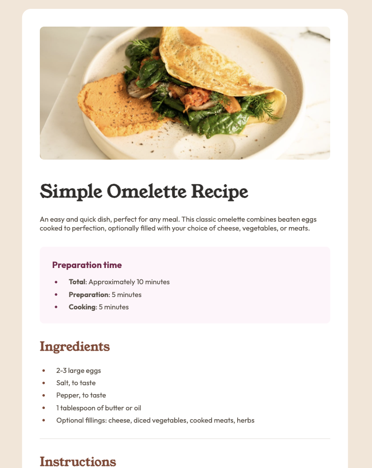

# Frontend Mentor - Recipe page solution

This is a solution to the [Recipe page challenge on Frontend Mentor](https://www.frontendmentor.io/challenges/recipe-page-KiTsR8QQKm). Frontend Mentor challenges help you improve your coding skills by building realistic projects.

## Table of contents

- [Overview](#overview)
  - [The challenge](#the-challenge)
  - [Screenshot](#screenshot)
  - [Links](#links)
- [My process](#my-process)
  - [Built with](#built-with)
  - [What I learned](#what-i-learned)
- [Author](#author)

### Screenshot

### Links

- Solution URL: [GitHub](https://github.com/Alexr6667/recipe-page)
- Live Site URL: [GitHub Pages](https://alexr6667.github.io/recipe-page/)

## My process

### Built with

- Semantic HTML5 markup
- CSS custom properties

### What I learned

I learnt a lot about how to work with lists and tables and how to target and not target certain elements using child selectors in CSS.
I tried using Tailwind CSS but found this to take too long and be ver cumbersome.

## Author

- GitHub - [Alexr6667](https://github.com/Alexr6667)
- Frontend Mentor - [@Alex6667](https://www.frontendmentor.io/profile/Alexr6667)
